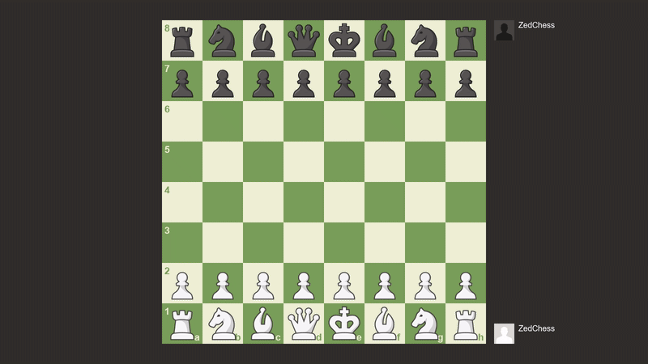

# ZedChessEngine

An homemade application to play chess with the implemention of a chess IA with ~1500 elo.

## Presentation

The application supports [FEN](https://en.wikipedia.org/wiki/Forsyth%E2%80%93Edwards_Notation) which allow to load custom position. Interactions with the engine can be performed through CLI or GUI.

The IA was tested against other chess engine and is able to win some games against ~1500 elo IA.
This IA is based [Negamax](https://en.wikipedia.org/wiki/Negamax) framework with [Alpha-Beta pruning](https://en.wikipedia.org/wiki/Alpha%E2%80%93beta_pruning) and [Iterative Deepening](https://en.wikipedia.org/wiki/Iterative_deepening_depth-first_search).
It goes through a generated [Search Tree](https://en.wikipedia.org/wiki/Search_tree) of positions reachable with each legal move.
It then evaluate reached position to determine its best possible move.

Various techniques were implemented to make the algorithm faster and more accurate : 
- Move Ordering
- Aspiration Windows
- Evaluation of Pieces
- Piece-Square Tables
- [Transposition Table](https://en.wikipedia.org/wiki/Transposition_table)
- [Zobrist hashing](https://en.wikipedia.org/wiki/Zobrist_hashing)
- Multithreading

Demonstration of 2 IAs playing each others :

## Dependencies
- [SDL2](https://www.libsdl.org/)
- [Visual Studio](https://visualstudio.microsoft.com/fr/) was used for this project but any IDE can be used.

## Build instructions

- Create a new project in your IDE
- Import files under the "src" directory as source files
- Install and link SDL2 to the project
- Build and run  
_Note : By default the application starts with CLI. You can use the `graphic` command to start GUI mode. Alternatively, use `-g` or `-graphic` parameter to start GUI._

## Resources 

- [Chess Programming Wiki](https://www.chessprogramming.org/Main_Page)
- Sprites and sounds originated from [chess.com](https://www.chess.com/)
